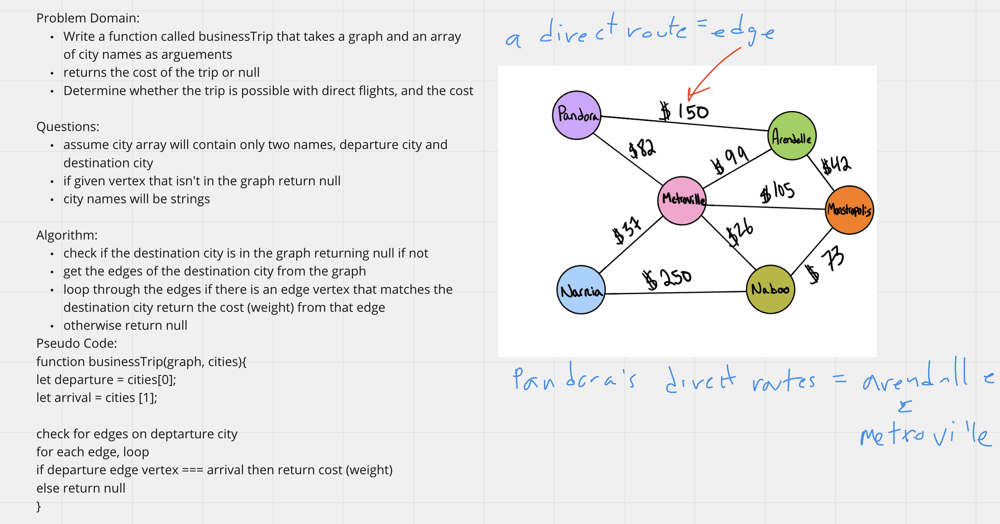

## Graph Business Trip Function
Write the following method for the Graph class:
- Write a function called businessTrip that takes a graph and an array of city names as arguments
- returns the cost of the trip or null
- Determine whether the trip is possible with direct flights, and the cost

## Whiteboard Process
<!-- Embedded whiteboard image -->

## Approach & Efficiency
<!-- What approach did you take? Discuss Why. What is the Big O space/time for this approach? -->
I utlized the white board process and TDD to help me walk through what I needed to do in order to properly create the graph breadth first traversal.

businessTrip Efficiency:
- Time - O(n) Looking up the direct flights is a 0(1) task and looping through the edges is O(n), worst case scenario is departure city is connected to every other city and you loop through in which case your time scales with n.
- Space - O(1) we are returning a single value regardless of graph size.
