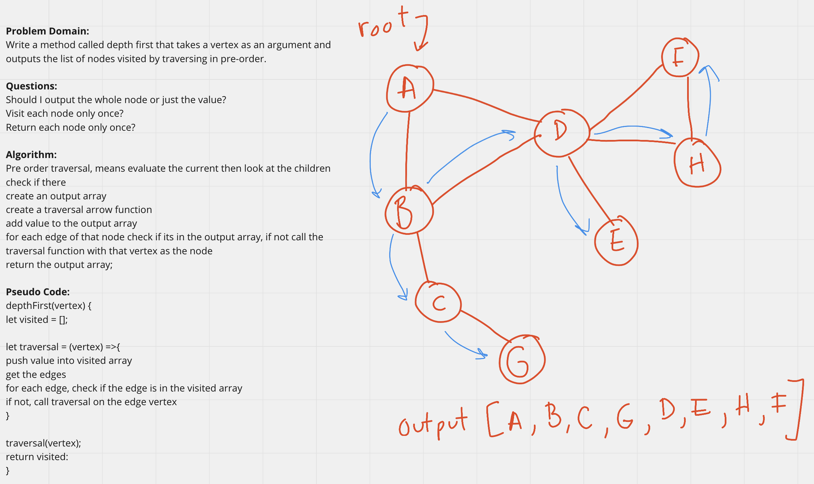

## Graph Depth First Traversal
Write the following method for the Graph class:
- depthFirst()
- Arguments: Node (vertex)
- Return: A collection of nodes (vertexs) in the the order of preorder traversal.
- Display the collection

## Whiteboard Process
<!-- Embedded whiteboard image -->

## Approach & Efficiency
<!-- What approach did you take? Discuss Why. What is the Big O space/time for this approach? -->
I utlized the white board process to help me walk through what I needed to do in order to properly create the graph depth first traversal. I utilized console logs during development to check what my function was doing.

breadthFirst Efficiency:
- Time - O(nlogn) the code traverses through each node, but also checks each node's edge isn't in the visited array, so its not directly n^2 but as the alogrithm gets closer to having traversed all of the nodes it will be searching more nodes through the visited array list.
- Space - O(n) adds a new array equal to the number of vertexs in the graph.