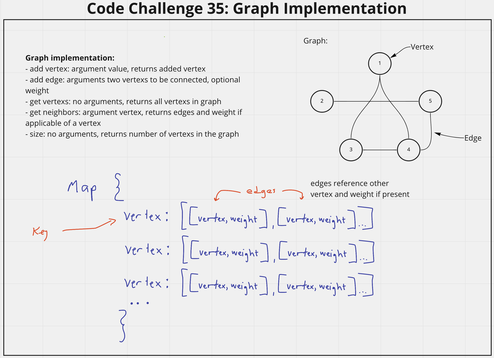

## Graph
<!-- Description of the challenge -->
Implement a graph class with the following methods:
- add vertex: argument value, returns added vertex
- add edge: arguments two vertexs to be connected, optional weight
- get vertexs: no arguments, returns all vertexs in graph
- get neighbors: argument vertex, returns edges and weight if applicable of a vertex 
- size: no arguments, returns number of vertexs in the graph

## Whiteboard Process
<!-- Embedded whiteboard image -->

## Approach & Efficiency
<!-- What approach did you take? Discuss Why. What is the Big O space/time for this approach? -->
I utlized the white board process to help me walk through what I needed to do in order to properly create the graph implmentation. I utilized console logs during development to check what my function was doing. I also took to opportunity to utilize TTD and also built my Graph class with the JavaScript Map to learn how Maps function.

Graph Method Efficiency:
- add vertex:
  - Time - O(1) adds just one vertex each time
  - Space - O(1) adds just one vertex each time
- add edge:
  - Time - O(1) fixed number of operations regardless of graph size
  - Space - O(1) fixed number of operations regardless of graph size
- get vertexs:
  - Time - O(n) needs to iterate through Map to get Keys
  - Space - O(n) returns an array the size of n items in graph
- get neighbors:
  - Time - O(1) returns stored value at Vertex without iteration
  - Space - O(1) no additional memory requirements
- size:
  - Time - O(1) returns Map size without iteration
  - Space - O(1) no additional memory requirements