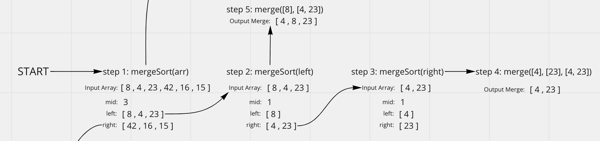
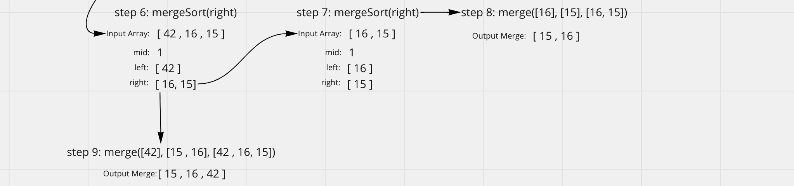
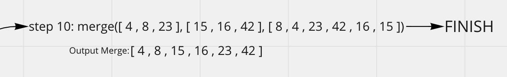

# Merge Sort

## The Pseudo Code

```js
ALGORITHM Mergesort(arr)
    DECLARE n <-- arr.length

    if n > 1
      DECLARE mid <-- n/2
      DECLARE left <-- arr[0...mid]
      DECLARE right <-- arr[mid...n]
      // sort the left side
      Mergesort(left)
      // sort the right side
      Mergesort(right)
      // merge the sorted left and right sides together
      Merge(left, right, arr)
```

The psudeo code above drafts a function called mergeSort(), that takes in an array of integers as a argument and sorts them in place (lowest value to highest value). Lets cover the basics here and then walk through each step as it sorts the example array `[8,4,23,42,16,15]`!

- `DECLARE n <-- arr.length`, variable n is intialized equal to the array length.
- `if n > 1`, check if array length is greater than 1.
- `DECLARE mid <-- n/2`, variable mid is intialized equal to n/2.
- `DECLARE left <-- arr[0...mid]`, variable left is intialized as an array of numbers from index 0 through mid.
- `DECLARE right <-- arr[mid...n]`, variable right is intialized as an array of numbers from mid through index n(end of array).
- `Mergesort(left)`, recursively call mergeSort function on the left array.
- `Mergesort(right)`, recursively call mergeSort function on the right array.
- `Merge(left, right, arr)`, merge left and right sides together.

Next we'll look at the helper function:

```js
ALGORITHM Merge(left, right, arr)
    DECLARE i <-- 0
    DECLARE j <-- 0
    DECLARE k <-- 0

    while i < left.length && j < right.length
        if left[i] <= right[j]
            arr[k] <-- left[i]
            i <-- i + 1
        else
            arr[k] <-- right[j]
            j <-- j + 1

        k <-- k + 1

    if i = left.length
       set remaining entries in arr to remaining values in right
    else
       set remaining entries in arr to remaining values in left
```

The psudeo code above drafts a helper function called merge().

- `DECLARE i <-- 0`, variable i is intialized equal to 0
- `DECLARE j <-- 0`, variable j is intialized equal to 0
- `DECLARE k <-- 0`, variable k is intialized equal to 0
- `while i < left.length && j < right.length`, while i is less than the length of the left array AND j is less than the length of the right array, loop.
- `if left[i] <= right[j]`, if the value in the left array at index i is less than or equal to the value in the right array at index j
- `arr[k] <-- left[i]`, assign the value in the original array at index k to the value in the left array at index i.
- `i <-- i + 1`, increment i by 1.
- `else arr[k] <-- right[j]`, assign the valuie in the original array at index k to the value in the right array at index j.
- `j <-- j + 1`, increment j by 1.
- `k <-- k + 1`, increment k by 1.
- `if i = left.length`, check if variable i is equal to the length of the left array.
- `set remaining entries in arr to remaining values in right`, loop through the remaining indexes in the array and the right array and set the values equal to the remaining values in the right array.
- `else set remaining entries in arr to remaining values in left`, loop through the remaining indexes in the array and the left array and set the values equal to the remaining values in the left array.

## Steps 1 through 5


 - step 1: the input array (array to be sorted) is split and the mergeSort function is called on the left array.
 - step 2: the input (left) array is split and the mergeSort function is called on the left array, since the length of the left array is NOT greater than 1 the function exits, and mergeSort is called with the right array.
 - step 3: the input array (right) is split and mergeSort doesn't execute on the left or right arrays due to the lengths.
 - step 4: merge is called on with left and right arrays and outputs a sorted array.
 - step 5: merge is now called on the left and right arrays from step 2, with the right array having been sorted in step 4, again the output is a sorted array.

## Steps 6 through 9


 - step 6: the input (right) array from step 1 is split and the mergeSort function is called on the right array, since the left array doesn't meet the length requirements.
 - step 7: the input (right) array is split and mergeSort doesn't execute on the left or right arrays due to the lengths.
 - step 8: merge is called with the left and right arrays and outputs a sorted array.
 - step 9: merge is now called on the left and right arrays from step 6, with the right array having been sorted in step 8, again the output is a sorted array.

## Step 10 (Final Step)


- step 10: in the final step the merge function is called using the left and right arrays split from step 1, although these arrays have now been sorted due to the previous steps. The final output is a merged sorted array.

## Conclusion

This is a really complex algorithm and I recommend whiteboarding and coding this problem yourself for a better understanding!

