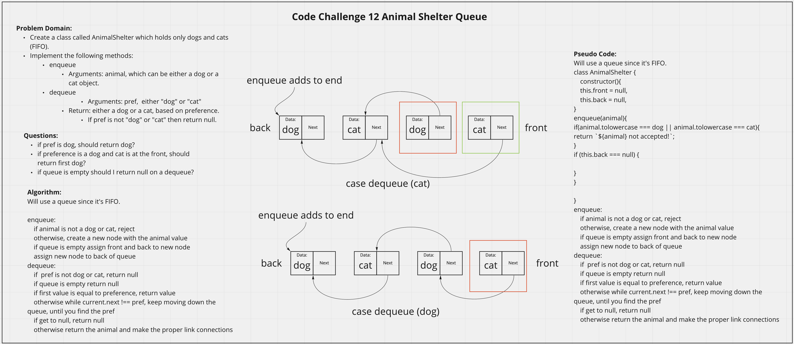

# Stack and Queue Pseudo
<!-- Description of the challenge -->
Create an AnimalShelter class with a Queue data structure that accepts only cats and dogs. Be able to add cats and dogs and be able to remove the first cat or dog in the Queue depending on the preference (FIFO).
- AnimalShelter Methods
  - enqueue: adds one node to the back with a value of either cat or dog
  - dequeue: removes first node with the value of the preference entered as an argument

## Whiteboard Process
<!-- Embedded whiteboard image -->

## Approach & Efficiency
<!-- What approach did you take? Discuss Why. What is the Big O space/time for this approach? -->
I utlized my white board model to help me walk through what I needed to do in order to properly create each method for the AnimalShelter. I utilized console logs during development to check what my AnimalShelter methods were doing.

AnimalShelter Methods Efficiency:
  - enqueue(animal) 
    - O(1), as it always adds to the back of the Queue, regardless of n one operation is performed

  - dequeue()
    - 0(n), if the preference entered is not in the queue or is in the back of the queue it potentially cycles through all values in the queue, so since it cycles through all values, it scales directly with n.
