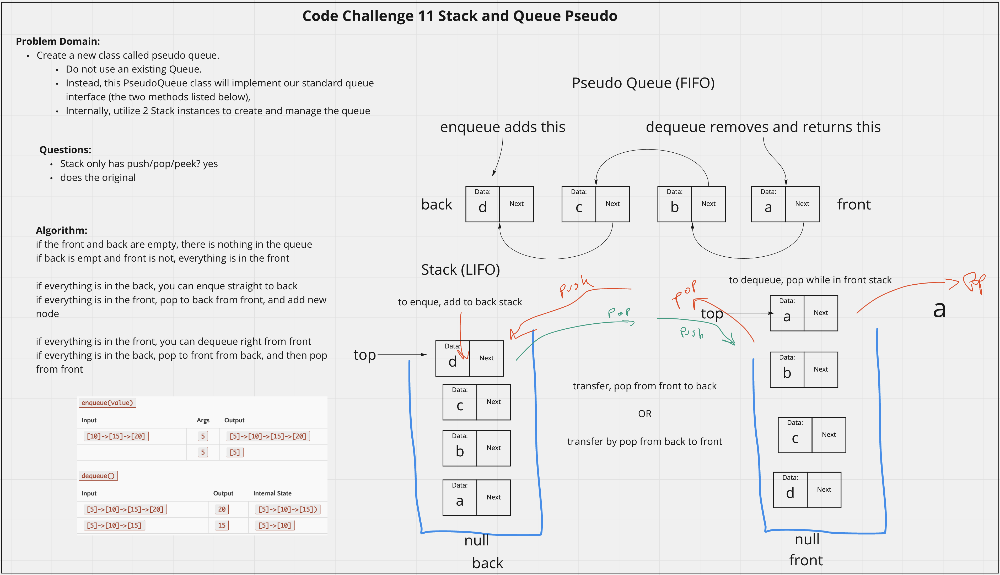

# Stack and Queue Pseudo
<!-- Description of the challenge -->
Using two stacks, create a class called Pseudo Queue that mimics a Queue (FIFO)
- Pseudo Queue Methods
  - enqueue: adds one node to the back
  - dequeue: removes node from the front and returns value

## Whiteboard Process
<!-- Embedded whiteboard image -->

## Approach & Efficiency
<!-- What approach did you take? Discuss Why. What is the Big O space/time for this approach? -->
I utlized my white board model to help me walk through what I needed to do in order to properly create each method for the Pseudo Queue. I utilized console logs during development to check what my Pseudo Queue methods were doing.

Pseudo Queue Methods Efficiency:
  - enqueue(val) 
    - O(1), if back stack is loaded as it will adds to the top of the back stack, regardless of n one operation is performed
    - 0(n), if front stack is loaded it will need to pop and push all nodes to the back stack, then push the new node on, so since it cycles through all values, it scales directly with n.
  - dequeue()
    - O(1), if front stack is loaded as it will pop from the top of the front stack, regardless of n one operation is performed
    - 0(n), if back stack is loaded it will need to pop and push all nodes to the front stack, then pop the top front node, so since it cycles through all values, it scales directly with n.
