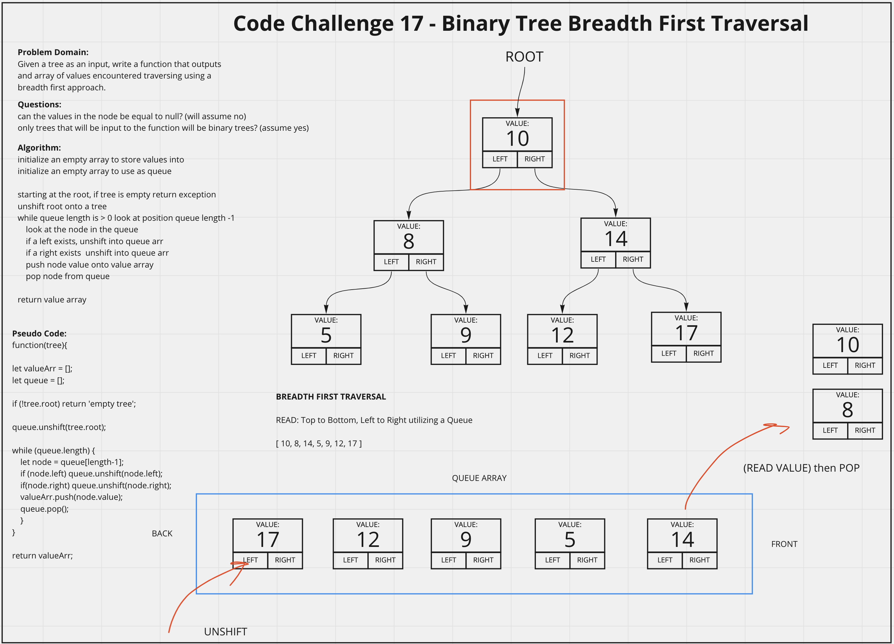

# Binary Tree Breadth First Traverse
<!-- Description of the challenge -->
Write a function that takes in a binary tree as an argument and returns an array of values encountered during a breadth first traversal of the tree.

## Whiteboard Process
<!-- Embedded whiteboard image -->

## Approach & Efficiency
<!-- What approach did you take? Discuss Why. What is the Big O space/time for this approach? -->
I utlized my white board model to help me walk through what I needed to do in order to properly create the breadthFirst() function to traverse a Binary Tree. For this challenge instead of creating a queue class, I utlized built in methods on an array to simulate a queue. I then utilized console logs during development to check what my methods were doing.

breadthFirst() Efficiency:
- Time = O(n) as the worst case senario is traversing the whole tree, which scales with n.
- Space = O(n) even though I am tracking the values in two arrays, at most there will only be n values in storage which scales directly with n.