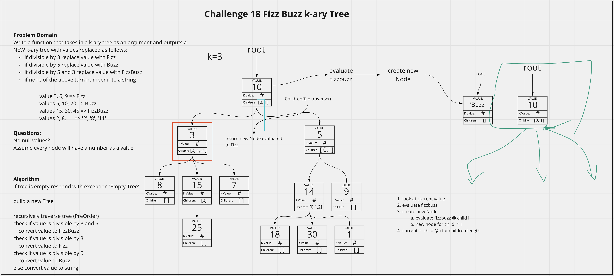

# Fizz Buzz K-ary Tree
<!-- Description of the challenge -->
Write a function that takes in a k-ary tree as an argument and outputs a NEW k-ary tree with values replaced as follows:
- if divisible by 3 replace value with Fizz
- if divisible by 5 replace value with Buzz
- if divisible by 5 and 3 replace value with FizzBuzz
- if none of the above turn number into a string

## Whiteboard Process
<!-- Embedded whiteboard image -->

## Approach & Efficiency
<!-- What approach did you take? Discuss Why. What is the Big O space/time for this approach? -->
Ended up walking through this problem with Daniel Jackson. Ultimately he was able to find a solution that worked first, but we were able to walk through our thoughts using the whiteboard. Utlimately we used recursion to traverse the k-ary list and generate new nodes.

breadthFirst() Efficiency:
- Time = O(n) as the worst case senario is traversing the whole tree, which scales with n.
- Space = O(2n) since we output an additional tree, it now consumes twice as much space.