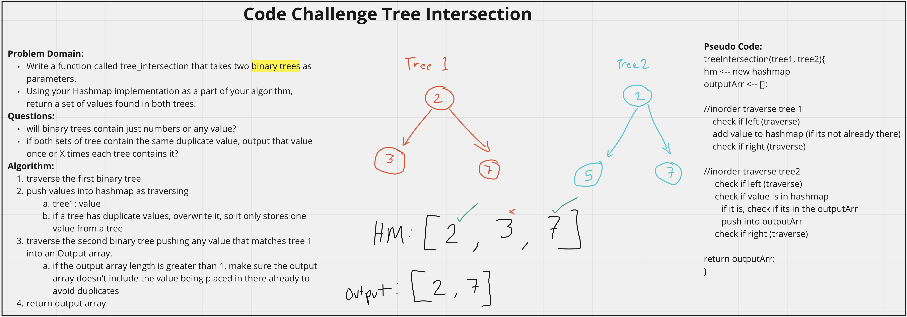

# Hashmap Repeated Word
<!-- Description of the challenge -->
Write a function called tree_intersection that takes two binary trees as parameters and using a Hashmap implementation return a set of values found in both trees.

## Whiteboard Process
<!-- Embedded whiteboard image -->

## Approach & Efficiency
<!-- What approach did you take? Discuss Why. What is the Big O space/time for this approach? -->
I utlized the white board process to help me walk through what I needed to do in order to properly create the repeatedWord function. I utilized console logs during development to check what my function was doing.

repeatedWord() Efficiency:
- time: worst case is 0(n) as it will loop through each tree 1 time, which scales with n.
- space: worst case is 0(2n) worst case senario we are requiring 2n of extra space with the hashmap and output array.