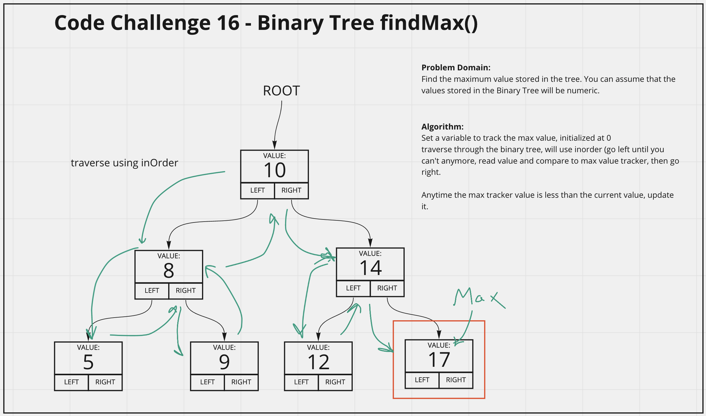

# Binary Tree Find Max
<!-- Description of the challenge -->
Create a Binary Tree with a Method, findMax, that returns the maximum value in the tree, assuming only numbers as values.

## Whiteboard Process
<!-- Embedded whiteboard image -->

## Approach & Efficiency
<!-- What approach did you take? Discuss Why. What is the Big O space/time for this approach? -->
I utlized my white board model to help me walk through what I needed to do in order to properly create the findMax() method for the Binary Tree. I utilized console logs during development to check what my methods were doing.

Binary Tree findMax() Method Efficiency:
- Time = 0(n) as the worst case senario is traversing the whole tree, which scales with n. This could be reduced to O(1) if we tracked the max value when adding a node, and just returned that value with this method.
- Space = O(1) as regardless of size we only track the maxValue variable.
