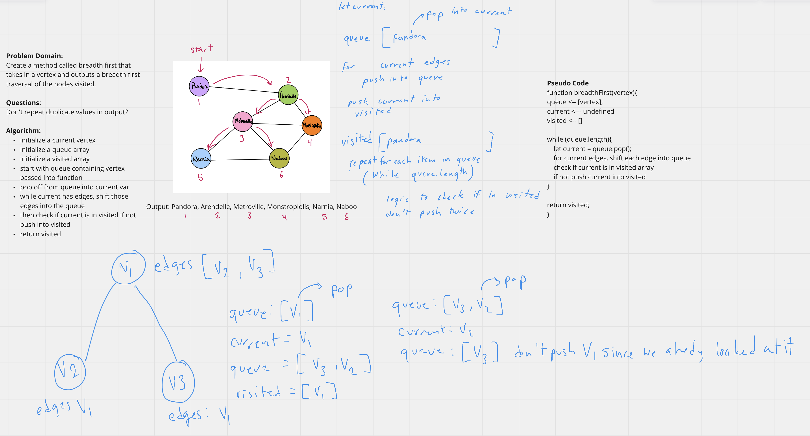

## Graph Breadth First Traversal
Write the following method for the Graph class:
- breadthFirst()
- Arguments: Node (vertex)
- Return: A collection of nodes (vertexs) in the order they were visited.
- Display the collection

## Whiteboard Process
<!-- Embedded whiteboard image -->

## Approach & Efficiency
<!-- What approach did you take? Discuss Why. What is the Big O space/time for this approach? -->
I utlized the white board process to help me walk through what I needed to do in order to properly create the graph breadth first traversal. I utilized console logs during development to check what my function was doing.

breadthFirst Efficiency:
- Time - O(n^3) worst case in a fully connected graph (where every vertex is connected to every other vertex) this method would loop through each node, and then each edge, and on the last vertex end up looping through all the of the nodes again checking if they are in the space.
- Space - O(n) adds a new array equal to the number of vertexs in the graph.
