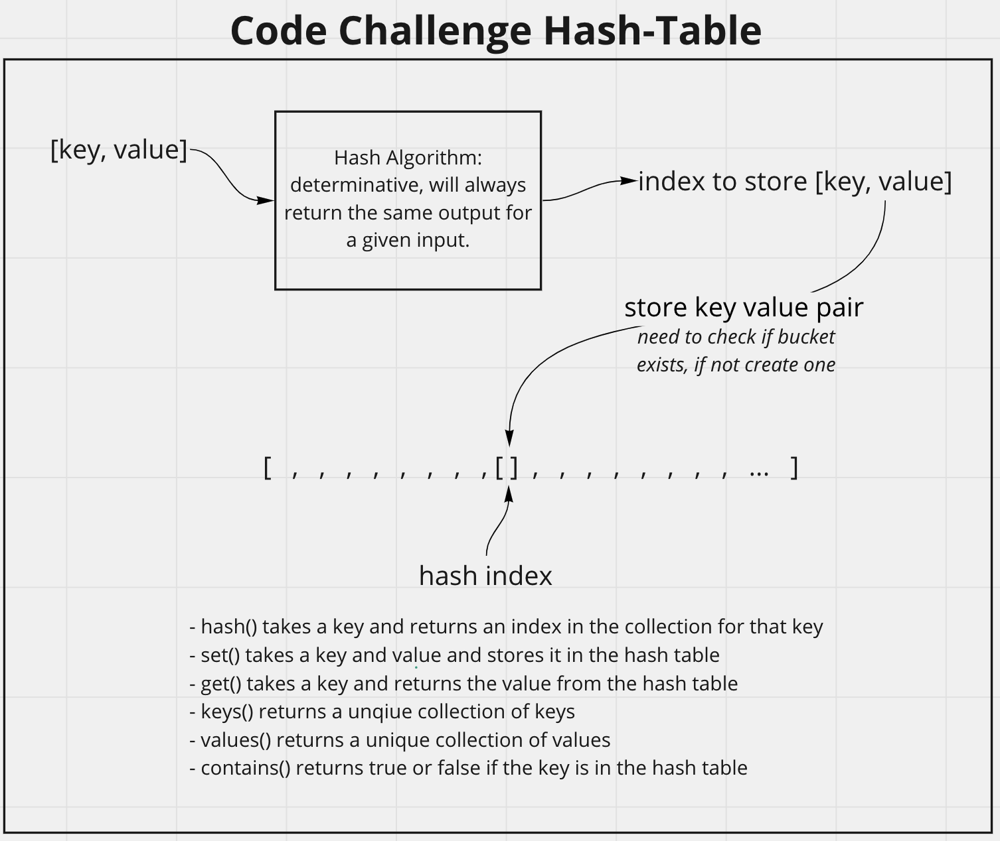

# Hash Table
<!-- Description of the challenge -->
Create a Hashtable Class with the following methods::
- hash() takes a key and returns an index in the collection for that key
- set() takes a key and value and stores it in the hash table
- get() takes a key and returns the value from the hash table
- keys() returns a unqiue collection of keys
- values() returns a unique collection of values
- contains() returns true or false if the key is in the hash table

## Whiteboard Process
<!-- Embedded whiteboard image -->

## Approach & Efficiency
<!-- What approach did you take? Discuss Why. What is the Big O space/time for this approach? -->
I utlized my white board model to help me walk through what I needed to do in order to properly create each method for the HashTable. I utilized console logs during development to check what my methods were doing.

HashTable Methods Efficiency:
- hash() O(1) has a fixed number of operations independant of n
- set() O(1) has a fixed number of operations independant of n
- get() O(1) has a fixed number of operations independant of n
- keys() O(n) it loops through each array to check the value worst case loops through n items
- values() O(n) it loops through each array to check the value worst case loops through n items
- contains() O(n) it loops through each array to check the value worst case loops through n items