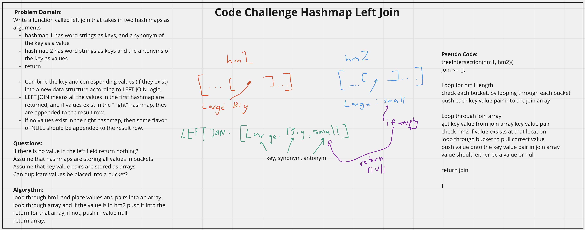

# Hashmap Left Join
<!-- Description of the challenge -->
Write a function called left join that takes in two hash maps as arguments
- hashmap 1 has word strings as keys, and a synonym of the key as a value
- hashmap 2 has word strings as keys and the antonyms of the key as values
- Combine the key and corresponding values (if they exist) into a new data structure according to LEFT JOIN logic.
- LEFT JOIN means all the values in the first hashmap are returned, and if values exist in the “right” hashmap, they are appended to the result row.
- If no values exist in the right hashmap, then some flavor of NULL should be appended to the result row.

## Whiteboard Process
<!-- Embedded whiteboard image -->

## Approach & Efficiency
<!-- What approach did you take? Discuss Why. What is the Big O space/time for this approach? -->
I utlized the white board process to help me walk through what I needed to do in order to properly create the leftJoin function. I utilized console logs during development to check what my function was doing.

leftJoin() Efficiency:
- time: worst case is 0(2n) as it will loop through the first hashmap n times, then loop through the join array n times, both scale with n.
- space: worst case is 0(n) as it may be potentially repeating the whole hashmap in an additional array.