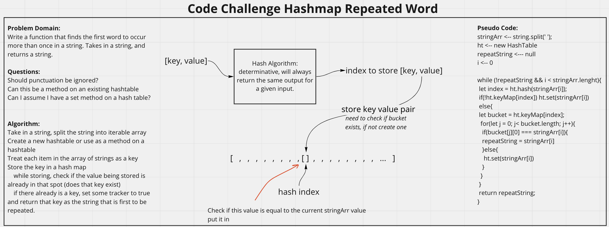

# Hashmap Repeated Word
<!-- Description of the challenge -->
Write a function that finds the first word to occur more than once in a string.

## Whiteboard Process
<!-- Embedded whiteboard image -->

## Approach & Efficiency
<!-- What approach did you take? Discuss Why. What is the Big O space/time for this approach? -->
I utlized the white board process to help me walk through what I needed to do in order to properly create the repeatedWord function. I utilized console logs during development to check what my function was doing.

repeatedWord() Efficiency:
- time: worst case is 0(n) as it will loop through the whole array n times, which scales with n.
- space: worst case is 0(n) as it stores the entire string in a hash map which scales with n.