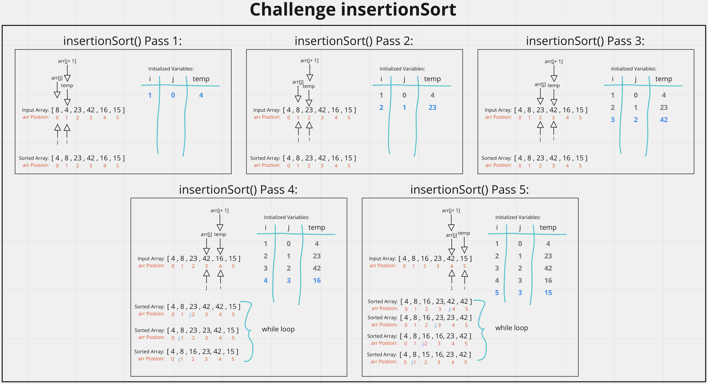

# Insertion Sort
<!-- Description of the challenge -->
Provided with the following code, walk through the values at each loop and code/test the solution.

```js
  InsertionSort(int[] arr)

    FOR i = 1 to arr.length

      int j <-- i - 1
      int temp <-- arr[i]

      WHILE j >= 0 AND temp < arr[j]
        arr[j + 1] <-- arr[j]
        j <-- j - 1

      arr[j + 1] <-- temp
```

## Whiteboard Process
<!-- Embedded whiteboard image -->


## Approach & Efficiency
<!-- What approach did you take? Discuss Why. What is the Big O space/time for this approach? -->
Relied heavily on the whiteboard diagrams I made to understand my place in the algorithm and the individual values. Just stepped through line by line to understand what was happening in the psudeo code.

breadthFirst() Efficiency:
- Time = O(n^2) as the worst case senario we are looping through the arrays twice with the for and the while loop inside of it, which scales with n.
- Space = O(1) since the space doesn't scale directly with n.