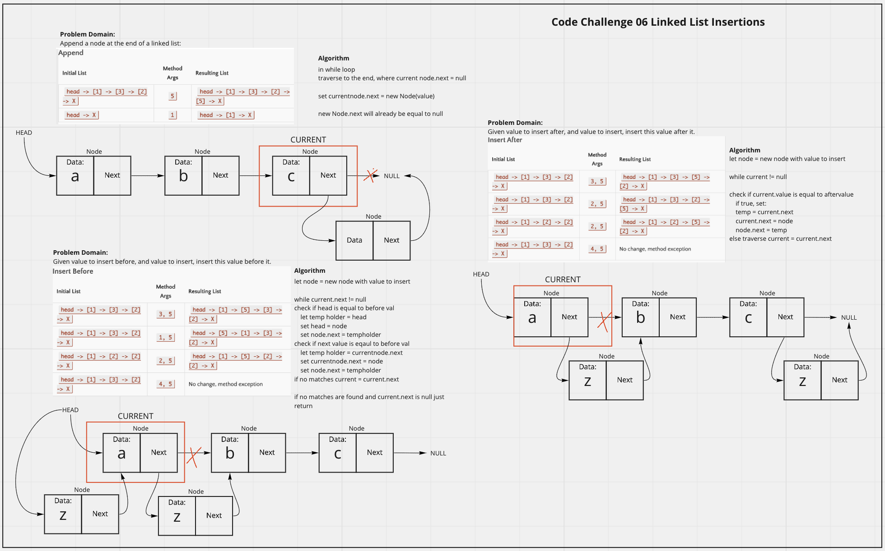

# Linked List Insertions
<!-- Description of the challenge -->
Add functionality to a singley linked list that can create a list, insert into the begining of the list, determine if a value is included, and print a string of the values in the list.

## Whiteboard Process
<!-- Embedded whiteboard image -->

## Approach & Efficiency
<!-- What approach did you take? Discuss Why. What is the Big O space/time for this approach? -->
I utlized my white board model to help me walk through what I needed to do in order to properly create each method for the linked list. I utlized console logs during development to check what my list was doing, especially the toString() method for visualizing the output. For append, insertBefore, and insertAfter, the efficency is O(n) because worst case would be iterating through the whole linked list each time and it directly grows with n.