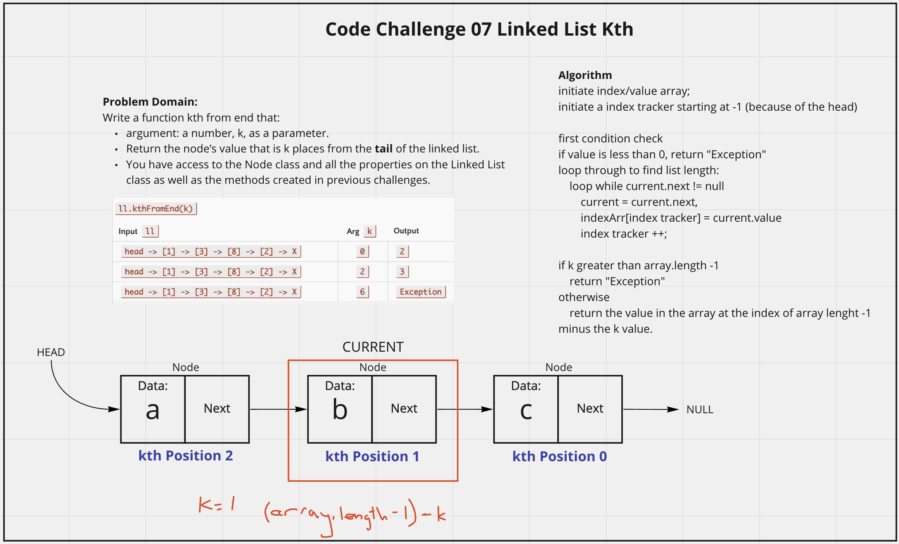

# Linked List Kth From End
<!-- Description of the challenge -->
Add functionality to a singley linked list that takes argument: a number, k, as a parameter can :
- Return the node’s value that is k places from the tail of the linked list.
- You have access to the Node class and all the properties on the Linked List class as well as the methods created in previous challenges.

## Whiteboard Process
<!-- Embedded whiteboard image -->

## Approach & Efficiency
<!-- What approach did you take? Discuss Why. What is the Big O space/time for this approach? -->
I utlized my white board model to help me walk through what I needed to do in order to properly create each method for the linked list. I utlized console logs during development to check what my list was doing. I'm not super excited about how my solution turned out, as I am mapping through the linked list and storing the values in an array, which elminates one of the advantages for a linked list memory wise. I chose this approach because the other solution I had in mind would require looping through the linked list potentially twice, which would be a worse time factor. So in the end I prioritized time.  For kthFromEnd, the efficency is O(n) because worst case would be iterating through the whole linked list once and the grabbing the index value of the solution, and it scales directly with n.