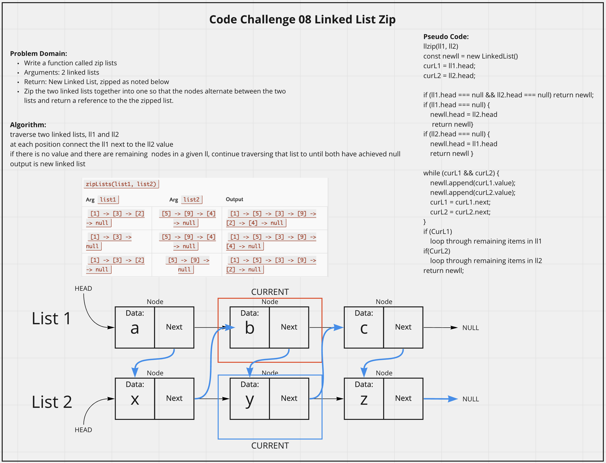

# Linked List Zip
<!-- Description of the challenge -->
Write a function called zip lists that takes two linked lists as arguments and return a new Linked List, zipped so that the nodes alternate between the two lists and return a reference to the the zipped list.

## Whiteboard Process
<!-- Embedded whiteboard image -->

## Approach & Efficiency
<!-- What approach did you take? Discuss Why. What is the Big O space/time for this approach? -->
I utlized my white board model to help me walk through what I needed to do in order to properly create each method for the linked list. I utlized console logs during development to check what my list was doing. This required me to think about the lists deferently than before because now I was utilizing the list from outside of the class object.  For llZip function, the efficency is O(n^2)) because worst case would be iterating through two whole linked list once and it scales directly with n (length of the lists).