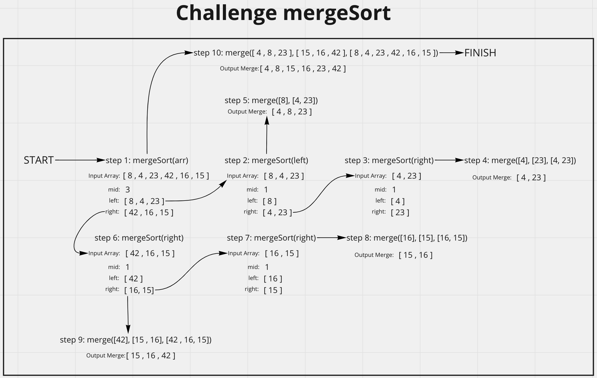

# Merge Sort
<!-- Description of the challenge -->
Provided with the following code, walk through the values at each loop and code/test the solution.

```js
ALGORITHM Mergesort(arr)
    DECLARE n <-- arr.length

    if n > 1
      DECLARE mid <-- n/2
      DECLARE left <-- arr[0...mid]
      DECLARE right <-- arr[mid...n]
      // sort the left side
      Mergesort(left)
      // sort the right side
      Mergesort(right)
      // merge the sorted left and right sides together
      Merge(left, right, arr)

ALGORITHM Merge(left, right, arr)
    DECLARE i <-- 0
    DECLARE j <-- 0
    DECLARE k <-- 0

    while i < left.length && j < right.length
        if left[i] <= right[j]
            arr[k] <-- left[i]
            i <-- i + 1
        else
            arr[k] <-- right[j]
            j <-- j + 1

        k <-- k + 1

    if i = left.length
       set remaining entries in arr to remaining values in right
    else
       set remaining entries in arr to remaining values in left
```

## Whiteboard Process
<!-- Embedded whiteboard image -->


## Approach & Efficiency
<!-- What approach did you take? Discuss Why. What is the Big O space/time for this approach? -->
Relied heavily on the whiteboard diagrams I made as well as console logging the code to understand my place in the algorithm and the individual values. Just stepped through line by line to understand what was happening in the psudeo code.

breadthFirst() Efficiency:
- Time = O(n*logn) as entire input must be iterated through, and this must occur O(log(n)) times (the input can only be halved O(log(n)) times). n items iterated log(n) times gives O(n log(n)). [source](https://softwareengineering.stackexchange.com/a/297161)
- Space = O(n) since the space used scales directly with n due to the recursion.