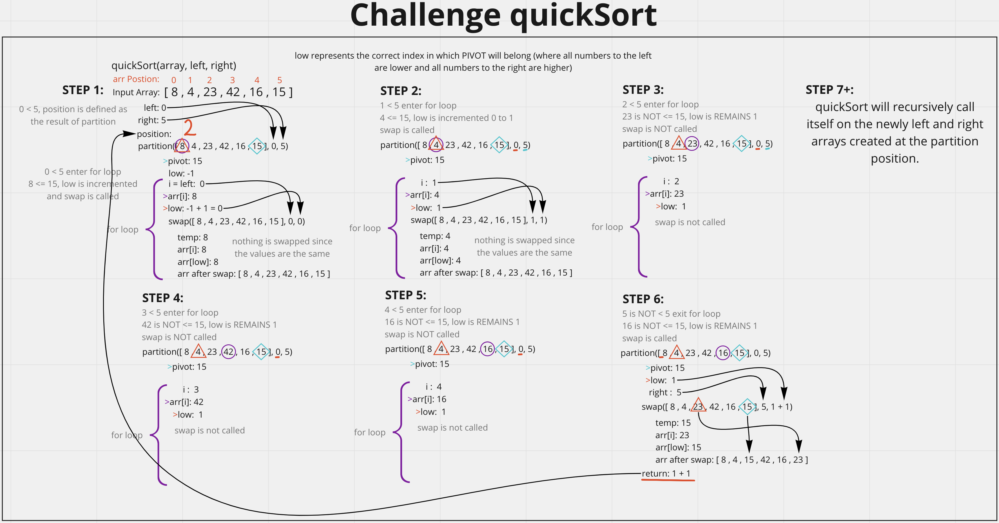

# Quick Sort
<!-- Description of the challenge -->
Provided with the following code, walk through the values at each loop and code/test the solution.

```js
ALGORITHM QuickSort(arr, left, right)
    if left < right
        // Partition the array by setting the position of the pivot value
        DEFINE position <-- Partition(arr, left, right)
        // Sort the left
        QuickSort(arr, left, position - 1)
        // Sort the right
        QuickSort(arr, position + 1, right)

ALGORITHM Partition(arr, left, right)
    // set a pivot value as a point of reference
    DEFINE pivot <-- arr[right]
    // create a variable to track the largest index of numbers lower than the defined pivot
    DEFINE low <-- left - 1
    for i <- left to right do
        if arr[i] <= pivot
            low++
            Swap(arr, i, low)

     // place the value of the pivot location in the middle.
     // all numbers smaller than the pivot are on the left, larger on the right.
     Swap(arr, right, low + 1)
    // return the pivot index point
     return low + 1

ALGORITHM Swap(arr, i, low)
    DEFINE temp;
    temp <-- arr[i]
    arr[i] <-- arr[low]
    arr[low] <-- temp
```

## Whiteboard Process
<!-- Embedded whiteboard image -->


## Approach & Efficiency
<!-- What approach did you take? Discuss Why. What is the Big O space/time for this approach? -->
Relied heavily on the whiteboard diagrams I made as well as console logging the code to understand my place in the algorithm and the individual values. Just stepped through line by line to understand what was happening in the psudeo code.

Efficiency:
- Time = O(logn) as each time you loop the array you are looping through gets smaller and you aren't looping through the whole array each time. So it doesn't scale directly with n.
- Space = O(n) since the since the worst case senario scales directly with n.