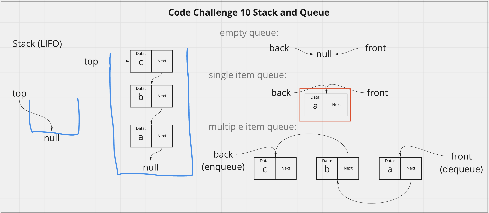

# Stack and Queue
<!-- Description of the challenge -->
Using a Linked List as the underlying data storage mechanism, implement both a Stack and a Queue.
- Stack Methods:
  - push(val) - add node to top of stack
  - pop() - remove top node and return value
  - peek() return value at top
  - isEmpty() return true or false

- Queue Methods:
  - enqueue(val) - add to back of queue
  - dequeue() - remove node at front and return value
  - peek() return value at front
  - isEmpty() return true or false

## Whiteboard Process
<!-- Embedded whiteboard image -->

## Approach & Efficiency
<!-- What approach did you take? Discuss Why. What is the Big O space/time for this approach? -->
I utlized my white board model to help me walk through what I needed to do in order to properly create each method for both the stack and queue. I utilized console logs during development to check what my stacks and queues were doing. For llZip function, the efficency is O(n^2)) because worst case would be iterating through two whole linked list once and it scales directly with n (length of the lists).

- Stack Methods Efficiency:
  - push(val) - O(1), only ever adds to the top, regardless of n one operation is performed
  - pop() - O(1), only ever removes from the top, regardless of n one operation is performed
  - peek() - O(1), only ever checks the top, regardless of n one operation is performed
  - isEmpty() - O(1), only ever checks value of the top, regardless of n one operation is performed

- Queue Methods Efficiency:
  - enqueue(val) - O(1), only ever adds to the back, regardless of n one operation is performed
  - dequeue() - O(1), only ever removes from the front, regardless of n one operation is performed
  - peek() - O(1), only ever checks the front, regardless of n one operation is performed
  - isEmpty() - O(1), only ever checks value of the front, regardless of n one operation is performed