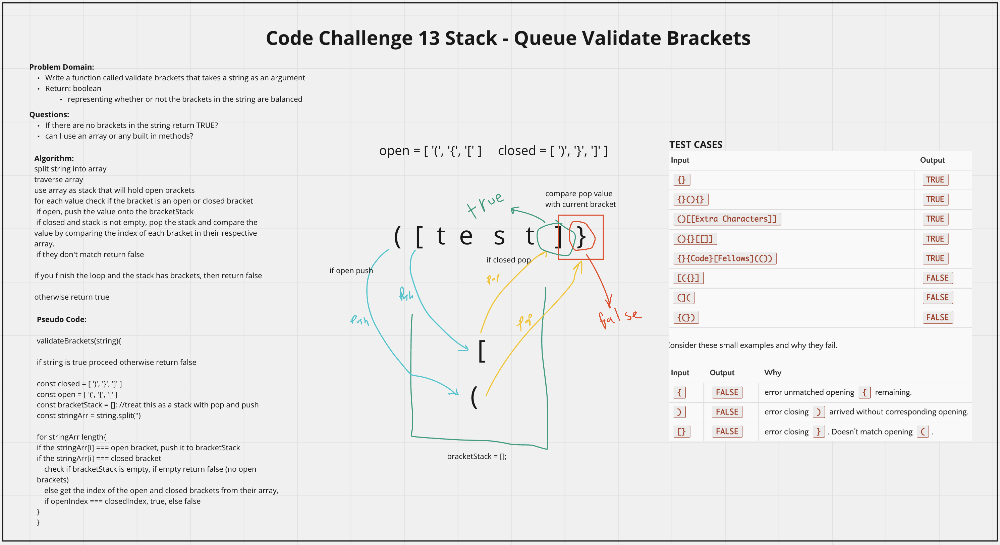

# Stack Queue Brackets
<!-- Description of the challenge -->
Create function that takes in a string and validates if any bracket pairs are closed correctly by returning true or false. 

## Whiteboard Process
<!-- Embedded whiteboard image -->

## Approach & Efficiency
<!-- What approach did you take? Discuss Why. What is the Big O space/time for this approach? -->
I utlized my white board model to help me walk through what I needed to do in order to properly create the validateBrackets function. Since you need to consider the last open bracket to properly closed it, they followed LIFO, so I utilized an array and treated it as a stack using pop and push. After spliting the string, I would loop through and check if the value was a closed bracket or an open bracket. If open I stored it in my stack. If a closed bracket I would check if there were any open brackets in the stack, if so I popped the value and did a comparison, if they didn't match return false. Lastly at the end I checked if there were any brackets left in the stack signalling an open unpaired bracket, if so, I returned false. I utilized console logs during development to check if my function was performing as expected.
