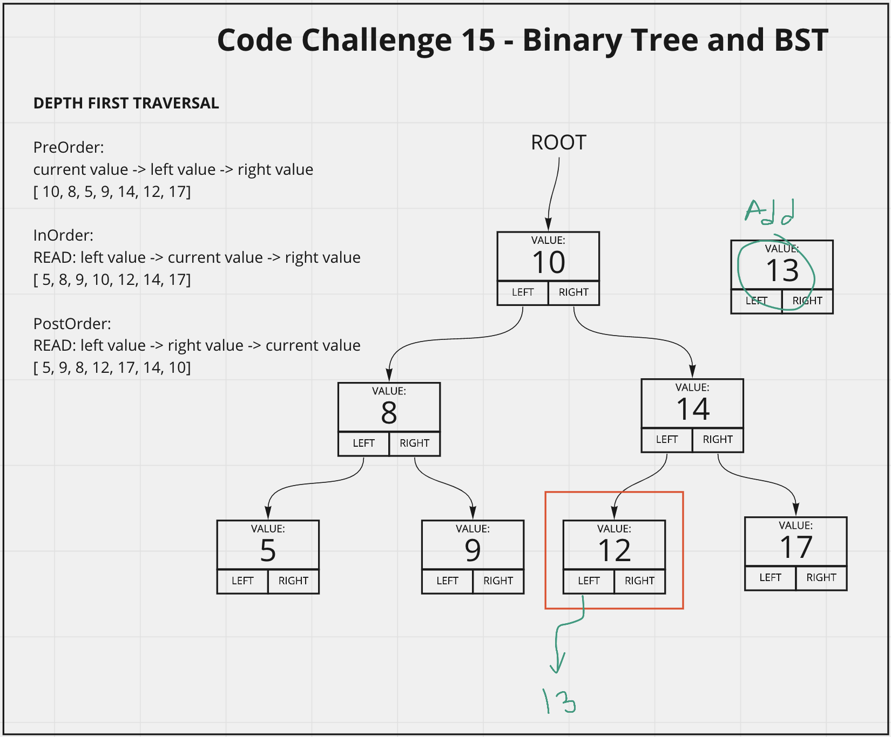

# Binary Tree and Binary Search Tree
<!-- Description of the challenge -->
Create a Binary Tree and Binary Search Tree class (sub-set of Binary Tree class) with the following methods:
- preOrder: current value -> left value -> right value
- inOrder: left value -> current value -> right value
- postOrder: left value -> right value -> current value
- add(val) BST only: add value to appropriate location in tree
- contains(val) BST only: return true or false if value is in tree

## Whiteboard Process
<!-- Embedded whiteboard image -->

## Approach & Efficiency
<!-- What approach did you take? Discuss Why. What is the Big O space/time for this approach? -->
I utlized my white board model to help me walk through what I needed to do in order to properly create each method for the Binary and Binary Search Trees. I utilized console logs during development to check what my methods were doing.

Binary Search Tree Methods Efficiency:
  - preOrder: 0(n), as it cycles through each value in the tree once, scales directly with n
  - inOrder: 0(n), as it cycles through each value in the tree once, scales directly with n
  - postOrder: 0(n), as it cycles through each value in the tree once, scales directly with n
  - add(val) 0(logn), it only tranverses a few nodes to get to the appropraite location, as n scales this becomes more efficient
  - contains(val) BST only: it only tranverses a few nodes to get to the appropraite location, as n scales this becomes more efficient
